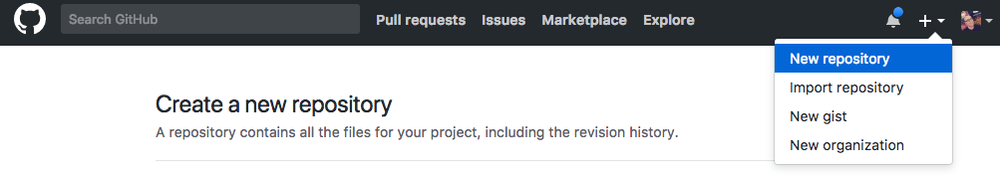
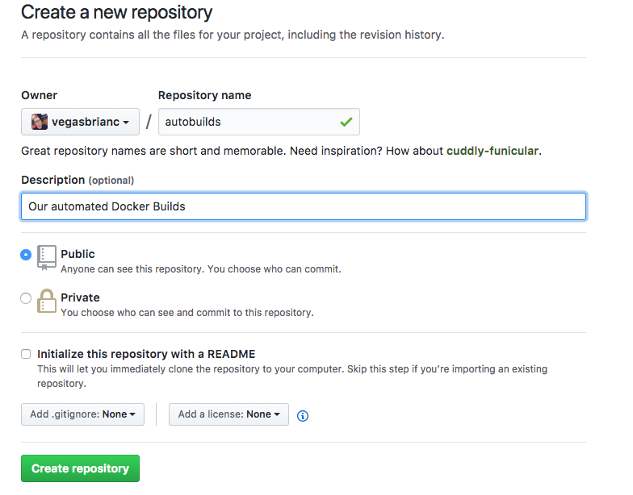
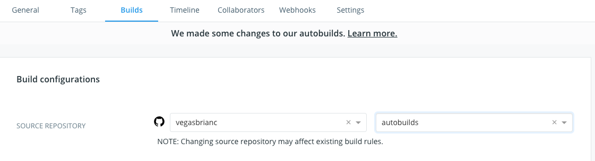
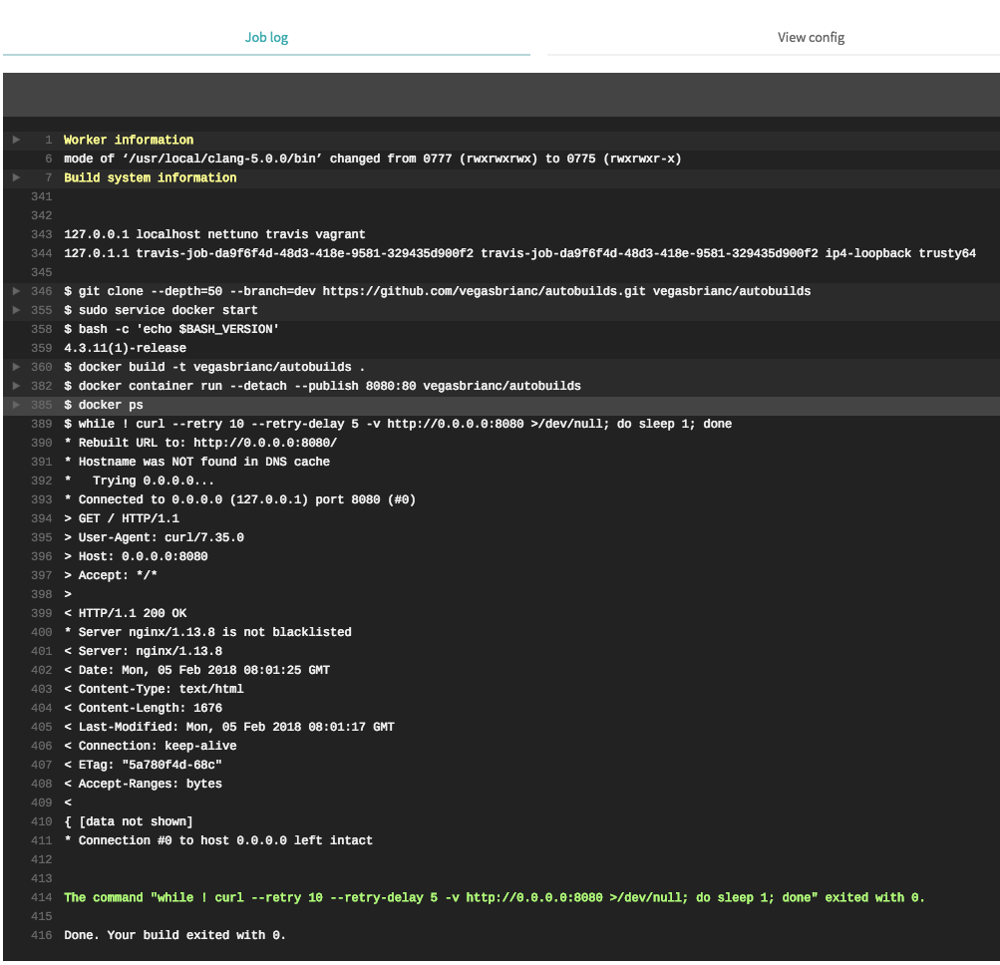

# Docker and DevOps

Now that we understand how to build Docker images it's now time to start autobuilding our changes with a pipeline `Dockerfile`

> **Tasks**:
>
>
> * [Task 1: Push your image to Docker Hub](#Task_1)
> * [Task 2: Setup a Automated Build](#Task_2)
> * [Task 3: Unit Test our Automated Builds](#Task_3)

## <a name="Task_1"></a>Task 1: Push your image to Docker Hub


### Prepararation 

1. In order to make commands more copy/paste friendly, export an environment variable containing your DockerID (if you don't have a DockerID you can get one for free via [Docker Cloud](https://cloud.docker.com))

    ```
    $ export DOCKERID=<your docker id>
    ```

2. To make sure it stored correctly by echoing it back in the terminal

    ```
    $ echo $DOCKERID
    <your docker id>
    ```


### Push your images to Docker Hub

List the images on your Docker host. You will see that you now have two `linux_tweet_app` images - one tagged as `1.0` and the other as `2.0`.

    
    $ docker image ls

    REPOSITORY                     TAG                 IMAGE ID            CREATED             SIZE
    vegasbrianc/linux_tweet_app   2.0                 01612e05312b        3 minutes ago       108MB
    vegasbrianc/linux_tweet_app   1.0                 bb32b5783cd3        7 minutes ago       108MB
    

These images are only stored in your Docker host's local repository. We want to `push` these images to Docker Hub so we can access the images from anywhere.

Distribution is built into the Docker platform. You can build images locally and push them to a public or private [registry](https://docs.docker.com/registry/), making them available to other users. Anyone with access can pull that image and run a container from it. The behavior of the app in the container will be the same for everyone, because the image contains the fully-configured app - the only requirements to run it are Linux and Docker.

[Docker Hub](https://hub.docker.com) is the default public registry for Docker images.

1. Before you can push your images, you will need to log into Docker Hub.

    ```
    $ docker login
    Username: <your docker id>
    Password: <your docker id password>
    Login Succeeded
    ```

    You will need to supply your Docker ID credentials when prompted.

2. Push version `1.0` of your web app using `docker image push`.

    ```
    $ docker image push $DOCKERID/linux_tweet_app:1.0

    The push refers to a repository [docker.io/<your docker id>/linux_tweet_app]
    910e84bcef7a: Pushed
    1dee161c8ba4: Pushed
    110566462efa: Pushed
    305e2b6ef454: Pushed
    24e065a5f328: Pushed
    1.0: digest: sha256:51e937ec18c7757879722f15fa1044cbfbf2f6b7eaeeb578c7c352baba9aa6dc size: 1363
    ```

    You'll see the progress as the image is pushed up to hub

3. Now push version `2.0`.

    ```
    $ docker image push $DOCKERID/linux_tweet_app:2.0

    The push refers to a repository [docker.io/<your docker id>/linux_tweet_app]
    0b171f8fbe22: Pushed
    70d38c767c00: Pushed
    110566462efa: Layer already exists
    305e2b6ef454: Layer already exists
    24e065a5f328: Layer already exists
    2.0: digest: sha256:7c51f77f90b81e5a598a13f129c95543172bae8f5850537225eae0c78e4f3add size: 1363
    ```

    Notice that several lines of the output say `Layer already exists`. This is because Docker will leverage read-only layers that are the same as any previously uploaded image layers.


    You can browse to `https://hub.docker.com/r/<your docker id>/` and see your newly-pushed Docker images. These are public repositories, so anyone can pull the images - you don't even need a Docker ID to pull public images.

## <a name="Task_2"></a>Task 2: Setup an Automated Build

### Prepare to push our newly created project to GitHub

It's time to automated our build pipeline. First, we need to create a GitHub Repo. 

1. Login to your [www.GitHub.com](https://www.github.com) account and click create new repository

<center></center>

2. Name the new repository `autobuilds` and fill in the description in optional

<center></center>

3. From the `linux_tweet_app` directory, initialize the project, commit, and perform the initial push to GitHub. Follow the directions which GitHub provides as seen below. 

4. Remove the Git directory

    ```
    $ rm -Rf .git
    ```

5. Initalize the Git directory

    ```
    $ git init
    ```

6. Add your Git Repo configuration to the local index

    ```
    $ git remote add origin https://github.com/<your GitHub username>/<your github repo name>.git
    ```

7. Add all files to Git index

    ```
    $ git add *
    ```

8. Commit Linux Tweet App files to the GitHub Autobuilds Repo

    ```
    $ git commit -m "First commit to Autobuilds"
    ```

9. Push the changes to GitHub

    ```
    $ git push --set-upstream origin master
    ```  


10. Now that we have pushed our project to GitHub we can now enable Autobuilds. Open [Docker Hub](www.hub.docker.com) click Repositories at the top menu bar and select the `Autobuilds` Repository

11. At the top menu click `Builds`

12. Connect GitHub and go back to the Repos -> Autobuilds Repo -> Builds

9. Click `Configure Autobuilds`

10. Select your GitHub User and the Autobuilds Repo
<center></center>

11. Click the `Create` button for Autobuilding. If everything was configured correclty this should trigger an auto-build. 

12. Click `Save & Build`

13. Navigate to the Recent Builds and click on the `Build in Master` to view the build logs

Once the autobuild has complete let's have a look around.

* First click the `Repo` Tab. What's populated here?
* Next click the `Tags` Tab
* Finally, click on the `Build Details` and click on the `Success` status. What do we see here and why?

### Test Automated Builds

Awesome! To ensure our automated builds are really working let's commit a new version of our `linux_tweet_app` to GitHub. When we push our changes to GitHub this will trigger an automated build in Docker Hub. Great, let's give it a try.

1. in the `linux_tweep_app` directoy edit the `index.html`
> Using your favorite editor (vi, emacs, etc)

    Edit the index.html file and edit line number 33 and change the text to "DevOps is Awesome"
   
    $ vi index.html
    

2. Commit our new changes to our GitHub Repo
    
    ```
    $ git add index.html

    $ git commit -m "updated index.html text to DevOps is Awesome"

    $ git push
    ```

3. Head back to your [Docker Hub](www.hub.docker.com) account and click on the `Build Details` tab of your `autobuilds` repo (Keep refreshing the page). You should now see if you are quick enough that your build is queued ready to be built by Docker Hub. Next, it will run through the build and and report back the status of your new build. Click on the status of the build once it has completed building to view the logs.

## <a name="Task_3"></a>Task 3: Unit Test our Automated Builds

Now, we have an automated Build pipeline in place that is automatically being built everytime a new commit is made to GitHub. The next logical step is to add some testing to our project to ensure what we are commiting is doing what it is suppose to do. In this section we will setup a `Travis Continous Integration`testing to check out container.

This section we will enable `Travis CI`, create a test script, and enable testing on our Repo. Sounds great, let's get started.

1. Open [Travis CI](https://travis-ci.org/) and in the upper click the big green button in the middle of the screen `SIGN UP`

2. Once we are signed up and signed in we can then add our Repo to Travis. Upper left corner click the `+`sign to add a new Repo. 

3. Flip the toggle switch for the `autobuilds` Repo

3. Now add the test to the Repo. This test will check that the container indeed can start and port 8080 is indeed accessible.
> Using your favorite editor (vi, emacs, etc) create a new file called `.travis.yml`

.travis.yml should contain the following. Be sure to update your Docker ID:

    sudo: required

    services:
        - docker

    language: bash

    before_script:
        - "docker build -t <Your Docker ID>/autobuilds ."
        - "docker container run --detach --publish 8080:80 <Your Docker ID>/autobuilds"
        - docker ps

    script:
        - while ! curl --retry 10 --retry-delay 5 -v http://0.0.0.0:8080 >/dev/null; do sleep 1; done
        

4. Add the `.travis.yml` file to our GitHub repo.
    
    ```
    $ git add .travis.yml

    $ git commit -m "added Travis CI testing to our Autobuild Repo"

    $ git push
    ```

5. Head back to [Travis CI](https://travis-ci.org/) and click on the `autobuilds` Repo in the left pane. Click the running job and we should now see the build log.

<center></center>


### OPTIONAL ADD BUILD STATUS TO PROJECT**


6. Update the build status in our `README.md`. At the top of the `TravisCI` page click on the build status icon.

<center></center>

7. Once the build status dialog box appears select `Markdown` as the format. Copy the Markdown 


> Using your favorite editor (vi, emacs, etc) edit the `README.md` file and paste the Markdown to the first line of the `README.md`

    ```
    [](https://travis-ci.org/vegasbrianc/autobuilds)
    ```

8. Commit the changes to `README.md`
    
    ```
    $ git add README.md

    $ git commit -m "added Travis CI build status to our Repo"

    $ git push
    ```


## Next Steps
For the next step in the tutorial head over to [Deploying an app to Docker Swarm](./votingapp.md)
