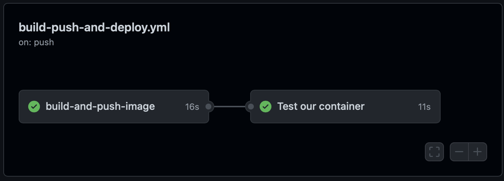

# Docker and DevOps

Now that we understand how to build Docker images it's now time to start autobuilding our changes with a pipeline `Dockerfile`

> **Tasks**:
>
> - [Task 1: Push your image to Docker Hub](#Task_1)
> - [Task 2: Setup a Automated Build](#Task_2)
> - [Task 3: Unit Test our Automated Builds](#Task_3)

## <a name="Task_1"></a>Task 1: Push your image to Docker Hub

### Preparation

1. In order to make commands more copy/paste friendly, export an environment variable containing your DockerID (if you don't have a DockerID you can get one for free via [Docker Hub](https://hub.docker.com))

   ```
   $ export DOCKERID=<your docker id>
   ```

2. To make sure it stored correctly by echoing it back in the terminal

   ```
   $ echo $DOCKERID
   <your docker id>
   ```

### Push your images to Docker Hub

List the images on your Docker host. You will see that you now have two `linux_tweet_app` images - one tagged as `1.0` and the other as `2.0`.

    $ docker image ls

    REPOSITORY                     TAG                 IMAGE ID            CREATED             SIZE
    vegasbrianc/linux_tweet_app   2.0                 01612e05312b        3 minutes ago       108MB
    vegasbrianc/linux_tweet_app   1.0                 bb32b5783cd3        7 minutes ago       108MB

These images are only stored in your Docker host's local repository. We want to `push` these images to Docker Hub so we can access the images from anywhere.

Distribution is built into the Docker platform. You can build images locally and push them to a public or private [registry](https://docs.docker.com/registry/), making them available to other users. Anyone with access can pull that image and run a container from it. The behavior of the app in the container will be the same for everyone, because the image contains the fully-configured app - the only requirements to run it are Linux and Docker.

[Docker Hub](https://hub.docker.com) is the default public registry for Docker images.

1. Before you can push your images, you will need to log into Docker Hub.

   ```
   $ docker login
   Username: <your docker id>
   Password: <your docker id password>
   Login Succeeded
   ```

   You will need to supply your Docker ID credentials when prompted.

2. Push version `1.0` of your web app using `docker image push`.

   ```
   $ docker image push $DOCKERID/linux_tweet_app:1.0

   The push refers to a repository [docker.io/<your docker id>/linux_tweet_app]
   910e84bcef7a: Pushed
   1dee161c8ba4: Pushed
   110566462efa: Pushed
   305e2b6ef454: Pushed
   24e065a5f328: Pushed
   1.0: digest: sha256:51e937ec18c7757879722f15fa1044cbfbf2f6b7eaeeb578c7c352baba9aa6dc size: 1363
   ```

   You'll see the progress as the image is pushed up to hub

3. Now push version `2.0`.

   ```
   $ docker image push $DOCKERID/linux_tweet_app:2.0

   The push refers to a repository [docker.io/<your docker id>/linux_tweet_app]
   0b171f8fbe22: Pushed
   70d38c767c00: Pushed
   110566462efa: Layer already exists
   305e2b6ef454: Layer already exists
   24e065a5f328: Layer already exists
   2.0: digest: sha256:7c51f77f90b81e5a598a13f129c95543172bae8f5850537225eae0c78e4f3add size: 1363
   ```

   Notice that several lines of the output say `Layer already exists`. This is because Docker will leverage read-only layers that are the same as any previously uploaded image layers.

   You can browse to `https://hub.docker.com/r/<your docker id>/` and see your newly-pushed Docker images. These are public repositories, so anyone can pull the images - you don't even need a Docker ID to pull public images.

## <a name="Task_2"></a>Task 2: Setup an Automated Build

### Prepare to push our newly created project to GitHub

It's time to automated our build pipeline. First, we need to create a GitHub Repo.

1. Login to your [www.GitHub.com](https://www.github.com) account and click create new repository

<center></center>

2. Name the new repository `autobuilds` and fill in the description in optional

<center></center>

3. From the `linux_tweet_app` directory, initialize the project, commit, and perform the initial push to GitHub. Follow the directions which GitHub provides as seen below.

4. Remove the Git directory

   ```
   $ rm -Rf .git
   ```

5. Initialize the Git directory

   ```
   $ git init
   ```

6. Change the branch name to main

   ```
   $ git checkout -b main
   ```

7. Add your Git Repo configuration to the local index

   ```
   $ git remote add origin https://github.com/<your GitHub username>/<your github repo name>.git
   ```

8. Add all files to Git index

   ```
   $ git add *
   ```

9. Commit Linux Tweet App files to the GitHub Autobuilds Repo

   ```
   $ git commit -m "First commit to Autobuilds"
   ```

10. Push the changes to GitHub

    ```
    $ git push --set-upstream origin master
    ```

Now that we have pushed our project to GitHub, the next step is to enable [GitHub Actions](https://github.com/features/actions) to build and push the image.

1. Generate a new Access Token on Docker Hub

   Go to the [Docker Hub Account Settings -> Security](https://hub.docker.com/settings/security)

2. Store the access token and further secrets in the GitHub Repository

   Go to Settings -> Secrets -> Actions and add the following _Repository Secrets_:

   - DOCKERHUB_USERNAME: <DOCKERID>
   - DOCKERHUB_TOKEN: <TOKEN>
   -

3. At the following content to the file `.github/workflows/build-push-and-deploy.yml`

```
---
name: Build, Push and Deploy

on:
  pull_request:
    branches:
      - 'main'
  push:
    branches:
      - 'main'

jobs:
  build-and-push-image:
    runs-on: ubuntu-latest
    steps:
      - name: Checkout
        uses: actions/checkout@v2.3.4

      # Configure Docker for Multi-Arch Images
      - name: Set up QEMU
        uses: docker/setup-qemu-action@v1.2.0

      # Login to DockerHub when no pull request
      - name: Login to DockerHub
        if: github.event_name != 'pull_request'
        uses: docker/login-action@v1
        with:
          username: ${{ secrets.DOCKERHUB_USERNAME }}
          password: ${{ secrets.DOCKERHUB_TOKEN }}

      # Configure the Docker Image Meta Data
      - name: Docker Meta
        id: docker_meta
        uses: docker/metadata-action@v3.4.1
        with:
          # list of Docker images to use as base name for tags
          images: |
            ${{ secrets.DOCKERHUB_USERNAME }}/${{ github.event.repository.name }}
          flavor: |
            latest=false
          tags: |
            type=raw,value=latest

      # Build and push the image
      - name: Build and Push
        id: docker_build
        uses: docker/build-push-action@v2.6.1
        with:
          push: ${{ github.event_name != 'pull_request' }}
          tags: ${{ steps.docker_meta.outputs.tags }}
          labels: ${{ steps.docker_meta.outputs.labels }}
```

13. Commit and Push the changes to GitHub

```
$ git add .github/workflows/build-push-and-deploy.yml
$ git commit -m "Added GitHub Actions Script"
$ git push
```

14. Click `Configure Autobuilds`

15. Select your GitHub User and the Autobuilds Repo
<center></center>

16. Click the `Create` button for Autobuilding. If everything was configured correctly this should trigger an auto-build.

17. Click `Save & Build`

18. Navigate to the Recent Builds and click on the `Build in Master` to view the build logs

Once the autobuild has complete let's have a look around.

- First click the `Repo` Tab. What's populated here?
- Next click the `Tags` Tab
- Finally, click on the `Build Details` and click on the `Success` status. What do we see here and why?

### Test Automated Builds

Awesome! To ensure our automated builds are really working let's commit a new version of our `linux_tweet_app` to GitHub. When we push our changes to GitHub this will trigger a new GitHub Action Workflow. Great, let's give it a try.

1.  in the `linux_tweet_app` directory edit the `index.html`

    > Using your favorite editor (vi, emacs, etc)

        Edit the index.html file and edit line number 33 and change the text to "DevOps is Awesome"

        $ vi index.html

2.  Commit our new changes to our GitHub Repo

    ```
    $ git add index.html

    $ git commit -m "updated index.html text to DevOps is Awesome"

    $ git push
    ```

3.  Head back to your GitHub Repository and click on the `Actions` tab. You should now see a new Workflow that was just now triggered (Maybe you need to wait a couple of seconds and refresh the page). If you click on the latest Workflow, you get to the Summary page, where you can see the `build-and-push-image` job. By clicking on this you can see all the logs and also failures, if something went wrong.

## <a name="Task_3"></a>Task 3: Unit Test our Automated Builds

Now, we have an automated Build pipeline in place that is automatically being built every time a new commit is made to GitHub. The next logical step is to add some testing to our project to ensure what we are committing is doing what it is suppose to do.

To do this, we need to add a new job to our GitHub Actions. This will start the previously build container and tries to connect to the HTTP port.

1. Add the following code snippet to your GitHub Actions file:

   ```
   test-container:
      name: Test our container
      needs: build-and-push-image
      runs-on: ubuntu-latest
      steps:
         - name: Checkout
         uses: actions/checkout@v2.3.4

         - name: Test
         run: |
            docker container run --detach --publish 8080:80  ${{ secrets.DOCKERHUB_USERNAME }}/${{ github.event.repository.name }}
            docker ps
            while ! curl --retry 10 --retry-delay 5 -v http://0.0.0.0:8080 >/dev/null; do sleep 1; done
   ```

2. Commit and push your changes to the GitHub repo

   ```
   $ git add .github/workflows/build-push-and-deploy.yml

   $ git commit -m "added testing job to our Autobuild Repo"

   $ git push
   ```

3. Head back to the GitHub Actions tab in your GitHub Repository. Select the latest workflow. There you should now see two jobs. After a successful build, you should see the following:

   <center></center>

### OPTIONAL ADD BUILD STATUS TO PROJECT\*\*

<center></center>

To add the build status to your project, you need to add the following line to your `README.md` file in your repositories root folder.

You can use your favorite editor (vi, emacs, VSCode, etc) edit the `README.md` file and paste the following snippet to the first line of the `README.md`

```

```

6. Commit the changes to `README.md`

```
$ git add README.md

$ git commit -m "Added GitHub Actions build status to our Repo"

$ git push
```

## Next Steps

For the next step in the tutorial head over to [Deploying an app to Docker Swarm](./votingapp.md)
