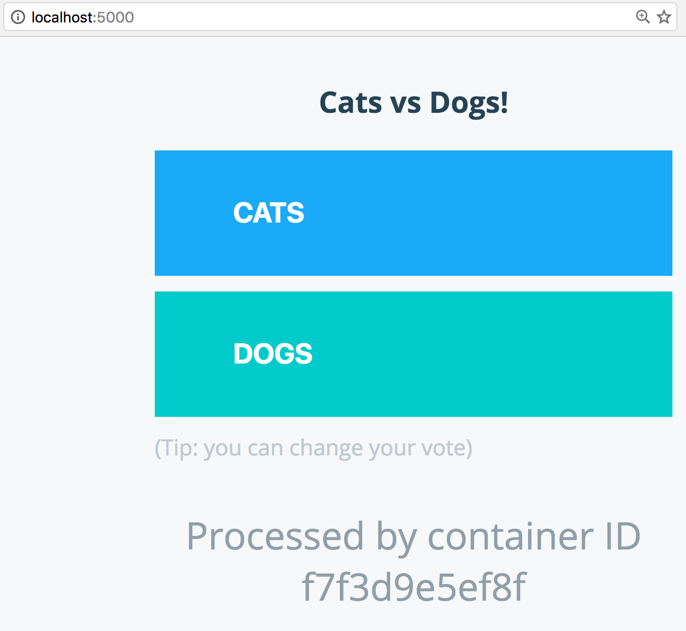

# Deploying an app with Docker Compose

This portion of the tutorial will guide you through using [Docker Compose](https://docs.docker.com/compose), to run and customize a voting app.

> **Tasks**:
>
> - [Task 1: Clone Voting App Repo](#task-1-clone-voting-app-repo)
> - [Task 2: Understand the Compose File](#task-2-understand-the-compose-file)
> - [Task 3: Run the Vote App with Docker Compose](#task-3-run-the-vote-app-with-docker-compose)
> - [Task 4: Customize the Voting App](#task-4-customize-the-voting-app)
> - [Task 5: Remove the containers](#task-5-remove-the-containers)

**Important.**
To complete this section, you will need to have Docker installed on your machine as mentioned in the [Setup](./setup.md) section. You'll also need to have git installed. There are many options for installing it. For instance, you can get it from [GitHub](https://help.github.com/articles/set-up-git/).

## Task 1: Clone Voting App Repo

For this application we will use the [Docker Example Voting App](https://github.com/docker/example-voting-app). This app consists of five components:

- Python webapp which lets you vote between two options
- Redis queue which collects new votes
- .NET worker which consumes votes and stores them in...
- Postgres database backed by a Docker volume
- Node.js webapp which shows the results of the voting in real time

1. Clone the repository onto your machine and `cd` into the directory:

   ```
   $ git clone https://github.com/docker/example-voting-app.git

   $ cd example-voting-app
   ```

## Task 2: Understand the Compose File

Locate the [Docker Compose](https://docs.docker.com/compose) file. The file we are looking for is in the Docker Example Voting App repo at the root level. It's called `docker-compose.yml`.

Let's review what is inside the file:

```
# version is now using "compose spec"
# v2 and v3 are now combined!
# docker-compose v1.27+ required

services:
  vote:
    build: ./vote
    # use python rather than gunicorn for local dev
    command: python app.py
    depends_on:
      redis:
        condition: service_healthy
    healthcheck:
      test: ["CMD", "curl", "-f", "http://localhost"]
      interval: 15s
      timeout: 5s
      retries: 3
      start_period: 10s
    volumes:
    - ./vote:/app
    ports:
      - "5000:80"
    networks:
      - front-tier
      - back-tier

  result:
    build: ./result
    # use nodemon rather than node for local dev
    entrypoint: nodemon server.js
    depends_on:
      db:
        condition: service_healthy
    volumes:
      - ./result:/app
    ports:
      - "5001:80"
      - "5858:5858"
    networks:
      - front-tier
      - back-tier

  worker:
    build:
      context: ./worker
    depends_on:
      redis:
        condition: service_healthy
      db:
        condition: service_healthy
    networks:
      - back-tier

  redis:
    image: redis:alpine
    volumes:
      - "./healthchecks:/healthchecks"
    healthcheck:
      test: /healthchecks/redis.sh
      interval: "5s"
    networks:
      - back-tier

  db:
    image: postgres:15-alpine
    environment:
      POSTGRES_USER: "postgres"
      POSTGRES_PASSWORD: "postgres"
    volumes:
      - "db-data:/var/lib/postgresql/data"
      - "./healthchecks:/healthchecks"
    healthcheck:
      test: /healthchecks/postgres.sh
      interval: "5s"
    networks:
      - back-tier

  # this service runs once to seed the database with votes
  # it won't run unless you specify the "seed" profile
  # docker compose --profile seed up -d
  seed:
    build: ./seed-data
    profiles: ["seed"]
    depends_on:
      vote:
        condition: service_healthy
    networks:
      - front-tier
    restart: "no"

volumes:
  db-data:

networks:
  front-tier:
  back-tier:
```

If you take a look at `docker-compose.yml`, you will see that the file defines

- vote container based on the vote folder
- result container based on the result folder
- redis container based on a redis image, to temporarily store the data.
- .NET based worker app based on the worker folder
- Postgres container based on a postgres image
- optional seed container, to populate the DB with votes

The Compose file also defines two networks, front-tier and back-tier. Each container is placed on one or two networks. Once on those networks, they can access other services on that network in code just by using the name of the service. Services can be on any number of networks. Services are isolated on their network. Services are only able to discover each other by name if they are on the same network. To learn more about networking check out the [Networking Lab](https://github.com/docker/labs/tree/master/networking).

Take a look at the file again, it start's with the following comment:

```
# version is now using "compose spec"
# v2 and v3 are now combined!
# docker-compose v1.27+ required
```

You will find many `docker-compose.yml` files that start with either `version: "2"` or `version: "3"`. These were the two major versions of the [compose specification](https://docs.docker.com/compose/compose-file/). v2 was used for `docker compose` and v3 brought all the features needed for `docker swarm`. However, over time the features where merged into one specification.

You will see there's also a `services` key, under which there is a separate key for each of the services. Such as:

```
  vote:
    build: ./vote
    # use python rather than gunicorn for local dev
    command: python app.py
    depends_on:
      redis:
        condition: service_healthy
    healthcheck:
      test: ["CMD", "curl", "-f", "http://localhost"]
      interval: 15s
      timeout: 5s
      retries: 3
      start_period: 10s
    volumes:
    - ./vote:/app
    ports:
      - "5000:80"
    networks:
      - front-tier
      - back-tier
```

The `build` key specifies, were compose can find the `Dockerfile` to build the image to use. You can also use the `image` tag, as you can see in the `redis` or `db` service. This will then pull and start a container based on an existing image.

The `command` key, allows you to specify the command that is executed inside the container. This will overwrite the `CMD` tag from the `Dockerfile`.

Much like with `docker run` you can define `volumes`, `ports` and `networks`. There's also a `depends_on` key which allows you to specify that a service is only deployed after another service, in this case `vote` only deploys after `redis`.

With the `healthcheck` key, you can define a check to figure out if the container is healthy or not. This allows the orchestrator to decide when traffic can be routed to it. Or a new container is needed as the current one is not running properly. You can find more details [here](https://docs.docker.com/compose/compose-file/05-services/#healthcheck).

## Task 3: Run the Vote App with Docker Compose

To start the app in the background you can run the following command:

```
$ docker compose up -d

[+] Running 7/7
 ✔ Network example-voting-app_front-tier  Created     0.0s
 ✔ Network example-voting-app_back-tier   Created     0.0s
 ✔ Container example-voting-app-redis-1   Healthy     5.8s
 ✔ Container example-voting-app-db-1      Healthy     5.8s
 ✔ Container example-voting-app-result-1  Started     6.3s
 ✔ Container example-voting-app-worker-1  Started     6.1s
 ✔ Container example-voting-app-vote-1    Started     6.2s
```

Find out more about the running containers:

```
$ docker compose ps
NAME                          IMAGE                       COMMAND                  SERVICE             CREATED              STATUS                        PORTS
example-voting-app-db-1       postgres:15-alpine          "docker-entrypoint.s…"   db                  About a minute ago   Up About a minute (healthy)   5432/tcp
example-voting-app-redis-1    redis:alpine                "docker-entrypoint.s…"   redis               About a minute ago   Up About a minute (healthy)   6379/tcp
example-voting-app-result-1   example-voting-app-result   "nodemon server.js"      result              About a minute ago   Up About a minute             0.0.0.0:5858->5858/tcp, 0.0.0.0:5001->80/tcp
example-voting-app-vote-1     example-voting-app-vote     "python app.py"          vote                About a minute ago   Up About a minute (healthy)   0.0.0.0:5002->80/tcp
example-voting-app-worker-1   example-voting-app-worker   "dotnet Worker.dll"      worker              About a minute ago   Up About a minute
```

The next step is to test whether you can access the app with your browser.

1. Access the voting side of the app: [http://localhost:5000](http://localhost:5000)



2. Select either `Dog` or `Cat` to vote.

3. View the results: [http://localhost:5001](http://localhost:5001)

   You should see the result of the previous vote

## Task 4: Customize the Voting App

In this step, you will customize the app and learn how you can use Docker Compose in your development process.

1. Change the topics you want to vote between

   The vote side of the app is located in the `vote` folder inside the repository. Search for the `app.py` script and replace _Cats_ and _Dogs_ with your choice of vote. After you saved the change, reload the vote page in your browser.

1. Change the result side

   As we are having a micro-services architecture, you also need to change the result page to update the displayed information.

   You can find this information in the `result` folder. Inside this folder, you need to go to the file `views/index.html` and adjust the votes accordingly. Reload the result page in the browser. You should now see that your results reflect the changes you just made.

## Task 5: Remove the containers

To remove the container you can run the following command:

```
$ docker compose down
[+] Running 7/7
 ✔ Container example-voting-app-result-1  Removed     0.4s
 ✔ Container example-voting-app-worker-1  Removed     0.2s
 ✔ Container example-voting-app-vote-1    Removed     0.3s
 ✔ Container example-voting-app-redis-1   Removed     0.1s
 ✔ Container example-voting-app-db-1      Removed     0.1s
 ✔ Network example-voting-app_back-tier   Removed     0.1s
 ✔ Network example-voting-app_front-tier  Removed     0.1s

```

This will stop the containers and remove them afterwards.

### Next Steps

For the next step in the tutorial head over to [Deploying an app to Docker Swarm](./votingapp-swarm.md)
