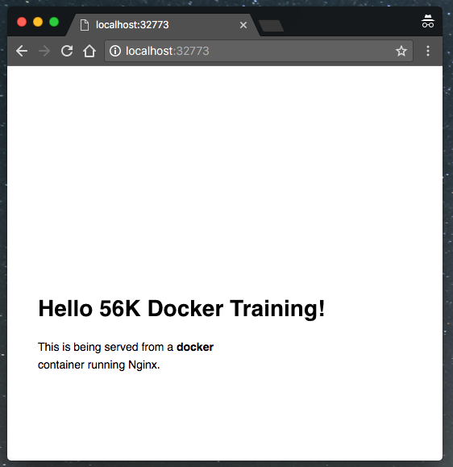

# 2.0 Webapps with Docker
Great! So you have now looked at `docker run`, played with a Docker container and also got the hang of some terminology. Armed with all this knowledge, you are now ready to get to the real stuff &#8212; deploying web applications with Docker.

> **Tasks**:
>

> * [Task 1: Run a static website in a container](#Task_1)
> * [Task 2: Docker Images](#Task_2)
> * [Task 3: Create your first image](#Task_3)
> * [Understanding Docker Volumes](#Understanding Docker Volumes)


### <a name="Task_1"></a>Task 1: Run a static website in a container
>**Note:** Code for this section is in this repo in the [static-site directory](https://github.com/docker/labs/tree/master/beginner/static-site).

Let's start by taking baby-steps. First, we'll use Docker to run a static website in a container. The website is based on an existing image. We'll pull a Docker image from Docker Store, run the container, and see how easy it is to set up a web server.

The image that you are going to use is a single-page website that was already created for this demo and is available on the Docker Store as [`dockersamples/static-site`](https://store.docker.com/community/images/dockersamples/static-site). You can download and run the image directly in one go using `docker run` as follows.

```
$ docker container run --detach dockersamples/static-site
```

>**Note:** The current version of this image doesn't run without the `-d` flag. The `-d` flag enables **detached mode**, which detaches the running container from the terminal/shell and returns your prompt after the container starts. We are debugging the problem with this image but for now, use `-d` even for this first example.

So, what happens when you run this command?

Since the image doesn't exist on your Docker host, the Docker daemon first fetches it from the registry and then runs it as a container.

Now that the server is running, do you see the website? What port is it running on? And more importantly, how do you access the container directly from our host machine?

Actually, you probably won't be able to answer any of these questions yet! &#9786; In this case, the client didn't tell the Docker Engine to publish any of the ports, so you need to re-run the `docker run` command to add this instruction.

Let's re-run the command with some new flags to publish ports and pass your name to the container to customize the message displayed. We'll use the *-d* option again to run the container in detached mode.

First, stop the container that you have just launched. In order to do this, we need the container ID.

Since we ran the container in detached mode, we don't have to launch another terminal to do this. Run `docker ps` to view the running containers.

```
$ docker container ps
CONTAINER ID        IMAGE                  COMMAND                  CREATED             STATUS              PORTS               NAMES
a7a0e504ca3e        dockersamples/static-site   "/bin/sh -c 'cd /usr/"   28 seconds ago      Up 26 seconds       80/tcp, 443/tcp     stupefied_mahavira
```

Check out the `CONTAINER ID` column. You will need to use this `CONTAINER ID` value, a long sequence of characters, to identify the container you want to stop, and then to remove it. The example below provides the `CONTAINER ID` on our system; you should use the value that you see in your terminal.
```
$ docker container stop a7a0e504ca3e
$ docker container rm   a7a0e504ca3e
```

>**Note:** A cool feature is that you do not need to specify the entire `CONTAINER ID`. You can just specify a few starting characters and if it is unique among all the containers that you have launched, the Docker client will intelligently pick it up.

Now, let's launch a container in **detached** mode as shown below:

```
$ docker container run --name static-site --env AUTHOR="Your Name" --detach --publish-all dockersamples/static-site
e61d12292d69556eabe2a44c16cbd54486b2527e2ce4f95438e504afb7b02810
```

In the above command:

*  `--detach` will create a container with the process detached from our terminal
* `-publish-all` will publish all the exposed container ports to random ports on the Docker host
* `--env` is how you pass environment variables to the container
* `--name` allows you to specify a container name
* `AUTHOR` is the environment variable name and `Your Name` is the value that you can pass

Now you can see the ports by running the `docker port` command.

```
$ docker port static-site
443/tcp -> 0.0.0.0:32772
80/tcp -> 0.0.0.0:32773
```

If you are running [Docker for Mac](https://docs.docker.com/docker-for-mac/), [Docker for Windows](https://docs.docker.com/docker-for-windows/), or Docker on Linux, you can open `http://localhost:[YOUR_PORT_FOR 80/tcp]`. For our example this is `http://localhost:32773`.


You can also run a second webserver at the same time, specifying a custom host port mapping to the container's webserver.

```
$ docker run --name static-site-2 --env AUTHOR="Your Name" --detach --publish 8888:80 dockersamples/static-site
```
<center></center>

* `--publish` will publish instruct the container to map the specified container port to the host port. `8888:80` = Host:Container Port

Now that you've seen how to run a webserver inside a Docker container, how do you create your own Docker image? This is the question we'll explore in the next section.

But first, let's stop and remove the containers since you won't be using them anymore.

```
$ docker container stop static-site
$ docker container rm static-site
```

Let's use a shortcut to remove the second site:

```
$ docker container rm -f static-site-2
```

Run `docker ps` to make sure the containers are gone.
```
$ docker ps
CONTAINER ID        IMAGE               COMMAND             CREATED             STATUS              PORTS               NAMES
```

### <a name="Task_2"></a>Task 2: Docker Images

In this section, let's dive deeper into what Docker images are. You will build your own image, use that image to run an application locally, and finally, push some of your own images to Docker Cloud.

The [Docker documentation](https://docs.docker.com/engine/userguide/storagedriver/imagesandcontainers/) gives a great explanation on how storage works with Docker images and containers, but here's the high points. 

* Images are comprised of layers
* These layers are added by each line in a Dockerfile
* Images on the same host or registry will share layers if possible
* When container is started it gets a unique writeable layer of its own to capture changes that occur while it's running
* Layers exist on the host file system in some form (usually a directory, but not always) and are managed by a [storage driver](https://docs.docker.com/engine/userguide/storagedriver/selectadriver/) to present a logical filesystem in the running container. 
* When a container is removed the unique writeable layer (and everything in it) is removed as well
* To persist data (and improve performance) Volumes are used. 
* Volumes (and the directories they are built on) are not managed by the storage driver, and will live on if a container is removed.  

A Docker image is built up from a series of layers. Each layer represents an instruction in the image’s Dockerfile. Each layer except the very last one is read-only. Consider the following Dockerfile:

```
    FROM ubuntu:15.04
    COPY . /app
    RUN make /app
    CMD python /app/app.py
```

This Dockerfile contains four commands, each of which creates a layer. The `FROM` statement starts out by creating a layer from the ubuntu:15.04 image. The `COPY` command adds some files from your Docker client’s current directory. The `RUN` command builds your application using the make command. Finally, the last layer specifies what command to run within the container. 

<center></center>

Multipe Containers can use the same Image. Each container has its own writable container layer, and all changes are stored in this container layer, multiple containers can share access to the same underlying image and yet have their own data state. The diagram below shows multiple containers sharing the same Ubuntu 15.04 image.

<center></center>

The following exercises will help to illustrate those concepts in practice. 

Let's start by looking at layers and how files written to a container are managed by something called *copy on write*.

Docker images are the basis of containers. In the previous example, you **pulled** the *dockersamples/static-site* image from the registry and asked the Docker client to run a container **based** on that image. To see the list of images that are available locally on your system, run the `docker images` command.

```
$ docker images
REPOSITORY             TAG                 IMAGE ID            CREATED             SIZE
dockersamples/static-site   latest              92a386b6e686        2 hours ago        190.5 MB
nginx                  latest              af4b3d7d5401        3 hours ago        190.5 MB
python                 2.7                 1c32174fd534        14 hours ago        676.8 MB
postgres               9.4                 88d845ac7a88        14 hours ago        263.6 MB
containous/traefik     latest              27b4e0c6b2fd        4 days ago          20.75 MB
node                   0.10                42426a5cba5f        6 days ago          633.7 MB
redis                  latest              4f5f397d4b7c        7 days ago          177.5 MB
mongo                  latest              467eb21035a8        7 days ago          309.7 MB
alpine                 3.3                 70c557e50ed6        8 days ago          4.794 MB
java                   7                   21f6ce84e43c        8 days ago          587.7 MB
```

Above is a list of images that we've pulled from the Docker registry and images I created myself (we'll shortly see how). You will have a different list of images on your machine. The `TAG` refers to a particular snapshot of the image and the `ID` is the corresponding unique identifier or hash for that image.

For simplicity, you can think of an image functions similarly to a git repository - images can be [committed](https://docs.docker.com/engine/reference/commandline/commit/) with changes and have multiple versions. When you do not provide a specific version number, the client defaults to `latest`.

For example, let's pull a specific version of `ubuntu` image as follows:

```
$ docker image pull ubuntu:12.04
```

If you do not specify the version number of the image then, as mentioned, the Docker client will default to a version named `latest`.

So for example, the `docker image pull` command given below will always pull the `latest` tag of an image. The example below pulls `ubuntu:latest` by default.

```
$ docker image pull ubuntu
```

To get a new Docker image you can either get it from a registry (such as the Docker Store) or create your own. There are hundreds of thousands of images available on [Docker Store](https://store.docker.com). You can also search for images directly from the command line using `docker search`.

An important distinction with regard to images is between _base images_ and _child images_.

- **Base images** are images that have no parent images, usually images with an OS like ubuntu, alpine or debian.

- **Child images** are images that build on base images and add additional functionality.

Another key concept is the idea of _official images_ and _user images_. (Both of which can be base images or child images.)

- **Official images** are Docker sanctioned images. Docker, Inc. sponsors a dedicated team that is responsible for reviewing and publishing all Official Repositories content. This team works in collaboration with upstream software maintainers, security experts, and the broader Docker community. These are not prefixed by an organization or user name. In the list of images above, the `python`, `node`, `alpine` and `nginx` images are official (base) images. To find out more about them, check out the [Official Images Documentation](https://docs.docker.com/docker-hub/official_repos/).

- **User images** are images created and shared by users like you. They build on base images and add additional functionality. Typically these are formatted as `user/image-name`. The `user` value in the image name is your Docker Store user or organization name.

### <a name="Task_3"></a>Task 3: Create your first image


## Layers and Copy on Write


1. Pull the Debian:Jessie image

    ```
    $ docker image pull debian:jessie
    jessie: Pulling from library/debian
    85b1f47fba49: Pull complete
    Digest: sha256:f51cf81db2de8b5e9585300f655549812cdb27c56f8bfb992b8b706378cd517d
    Status: Downloaded newer image for debian:jessie
    ```

2. Pull a MySQL image

    ```
    $ docker image pull mysql
    Using default tag: latest
    latest: Pulling from library/mysql
    85b1f47fba49: Already exists
    27dc53f13a11: Pull complete
    095c8ae4182d: Pull complete
    0972f6b9a7de: Pull complete
    1b199048e1da: Pull complete
    159de3cf101e: Pull complete
    963d934c2fcd: Pull complete
    f4b66a97a0d0: Pull complete
    f34057997f40: Pull complete
    ca1db9a06aa4: Pull complete
    0f913cb2cc0c: Pull complete
    Digest: sha256:bfb22e93ee87c6aab6c1c9a4e7cdc68e9cb9b64920f28fa289f9ffae9fe8e173
    Status: Downloaded newer image for mysql:latest
    ```

    What do you notice about those the output from the Docker pull request for MySQL?

    The first layer pulled says:

    `85b1f47fba49: Already exists`

    Notice that the layer id (`85b1f47fba498`) is the same for the first layer of the MySQl image and the only layer in the Debian:Jessie image. And because we already had pulled that layer when we pulled the Debian image, we didn't have to pull it again. 

    So, what does that tell us about the MySQL image? Since each layer is created by a line in the image's *Dockerfile*, we know that the MySQL image is based on the Debian:Jessie base image. We can confirm this by looking at the [Dockerfile on Docker Store](https://github.com/docker-library/mysql/blob/0590e4efd2b31ec794383f084d419dea9bc752c4/5.7/Dockerfile). 

    The first line in the the Dockerfile is: `FROM debian:jessie` This will import that layer into the MySQL image. 

    So layers are created by Dockerfiles and are are shared between images. When you start a container, a writeable layer is added to the base image. 

    Next you will create a file in our container, and see how that's represented on the host file system. 

3. Start a Debian container, shell into it.   

    ```
    $ docker run --tty --interactive --name debian debian:jessie bash
    root@e09203d84deb:/#
    ```

4. Create a file and then list out the directory to make sure it's there:

    ```
    root@e09203d84deb:/# touch test-file
    root@e09203d84deb:/# ls
    bin   dev  home  lib64  mnt  proc  run   srv  test-file  usrboot  etc  lib   media  opt  root  sbin  sys  tmp        var
    ```

    We can see  `test-file` exists in the root of the containers file system. 

    What has happened is that when a new file was written to the disk, the Docker storage driver placed that file in it's own layer. This is called *copy on write* - as soon as a change is detected the change is copied into the writeable layer. That layers is represented by a directory on the host file system. All of this is managed by the Docker storage driver. 

5. Exit the container but leave it running by pressing `ctrl-p` and then `ctrl-q`

<center></center>

    The Docker hosts for the labs today use OverlayFS with the [overlay2](https://docs.docker.com/engine/userguide/storagedriver/overlayfs-driver/#how-the-overlay2-driver-works) storage driver. 

    OverlayFS layers two directories on a single Linux host and presents them as a single directory. These directories are called layers and the unification process is referred to as a union mount. OverlayFS refers to the lower directory as lowerdir and the upper directory a upperdir. "Upper" and "Lower" refer to when the layer was added to the image. In our example the writeable layer is the most "upper" layer.  The unified view is exposed through its own directory called merged. 

    We can use Docker's *inspect* command to look at where these directories live on our Docker host's file system. 

    > Note: The *inspect* command uses Go templates to allow us to extract out specific information from its output. For more information on how these templates work with *inspect* read this [excellent tutorial](http://container-solutions.com/docker-inspect-template-magic/). 

    ```
    $ docker inspect -f '{{json .GraphDriver.Data}}' debian | python -mjson.tool
        
    {
      "LowerDir": "/var/lib/docker/overlay2/0dad4d523351851af4872f8c6706fbdf36a6fa60dc7a29fff6eb388bf3d7194e-init/diff:/var/lib/docker/overlay2/c2e2db4221ad5dca9f35a92e04d17c79b861ddee30015fa3ddc77c66ae1bf758/diff",
      "MergedDir": "/var/lib/docker/overlay2/0dad4d523351851af4872f8c6706fbdf36a6fa60dc7a29fff6eb388bf3d7194e/merged",
      "UpperDir": "/var/lib/docker/overlay2/0dad4d523351851af4872f8c6706fbdf36a6fa60dc7a29fff6eb388bf3d7194e/diff",
      "WorkDir": "/var/lib/docker/overlay2/0dad4d523351851af4872f8c6706fbdf36a6fa60dc7a29fff6eb388bf3d7194e/work"
    }
    ```

    > Note: `WorkDir` is a working directory for the Overlay2 driver

    Since the change we made is the newest modification to the Debian container's file system, it's going to be stored in `UpperDir`. 


6. Stop the contianer

    ```
    $ docker container stop debian
    ```

7. Ensure that your debian container still exists

    ```
    $ docker container ls --all
    CONTAINER ID        IMAGE               COMMAND             CREATED             STATUS           PORTS               NAMES
    674d7abf10c6        debian:jessie       "bash"              36 minutes ago      Exited (0) 2 minutes ago                       debian
    ```

8. Sart the Debian container again

    ```
    $ docker container start debian
    ```

8. Attach to the Debian container hit `enter` twice after completing the command

    ```
    $ docker container attach debian
    ```


    Because the container still exists, the files are still available on  your file system. At this point the file we created previously still exists.

    However, if we remove the container, the directories on the host file system will be removed, and your changes will be gone

13. Remove the container and list the directory contents

    ```
    $ docker container rm debian
    debian
    ```

    The files that were created are now gone and the container now reverts back to the base image which it was created from if we start it again.


## Understanding Docker Volumes

[Docker volumes](https://docs.docker.com/engine/admin/volumes/volumes/) are directories on the host file system that are not managed by the storage driver. Since they are not managed by the storage drive they offer a couple of important benefits. 

* **Performance**: Because the storage driver has to create the logical filesystem in the container from potentially many directories on the local host, accessing data can be slow. Especially if there is a lot of write activity to that container. In fact you should try and minimize the amount of writes that happen to the container's filesystem, and instead direct those writes to a volume

* **Persistence**: Volumes are not removed when the container is deleted. They exist until explicitly removed. This means data written to a volume can be reused by other containers. 

Volumes can be anonymous or named. Anonymous volumes have no way for the to be explicitly referenced. They are almost exclusively used for performance reasons as you cannot persist data effectively with anonymous volumes. Named volumes can be explicitly referenced so they can be used to persist data and increase performance. 

The next sections will cover both anonymous and named volumes. 

> Special Note: These next sections were adapted from [Arun Gupta's](https://twitter.com/arungupta) excellent [tutorial](http://blog.arungupta.me/docker-mysql-persistence/) on persisting data with MySQL. 


## Let's Take a Break then continue to Part 2
For the next step in the tutorial head over to [WebApps Part Deux](./webapps-part2.md)
