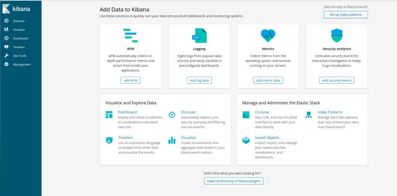
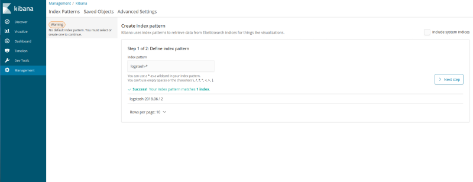
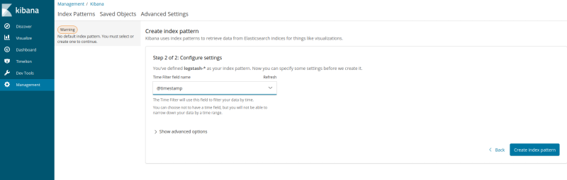
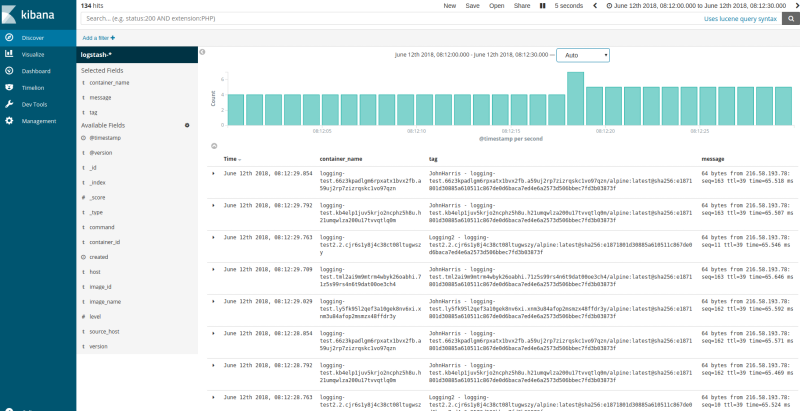
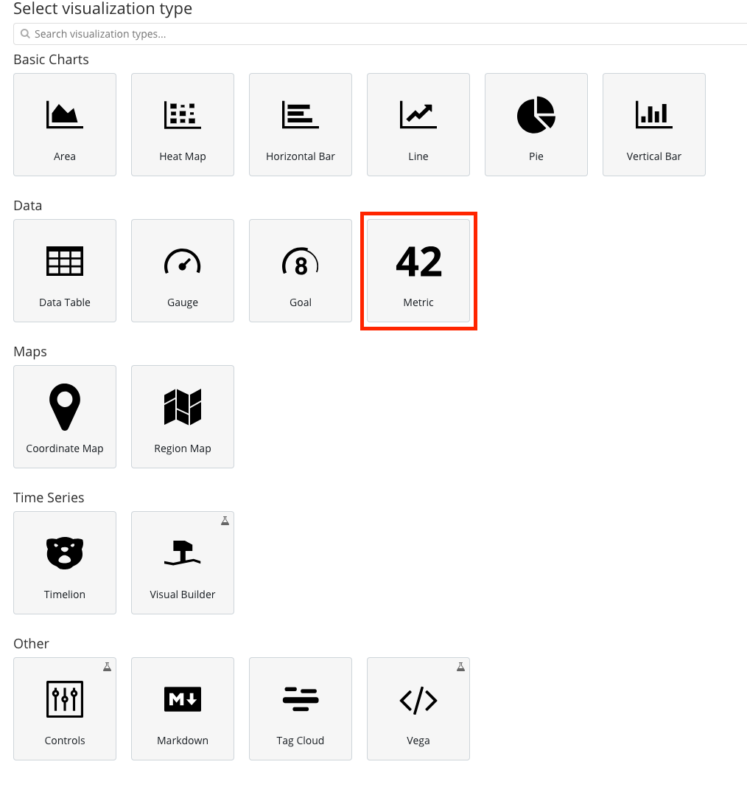
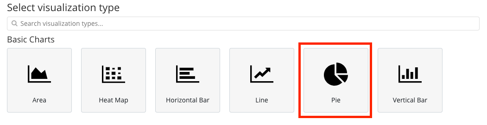
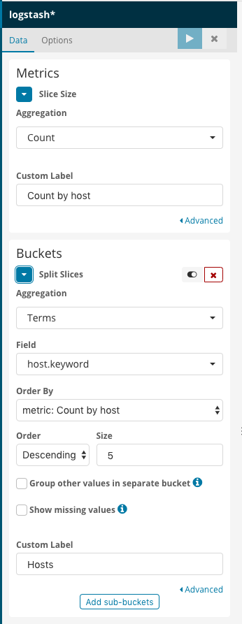
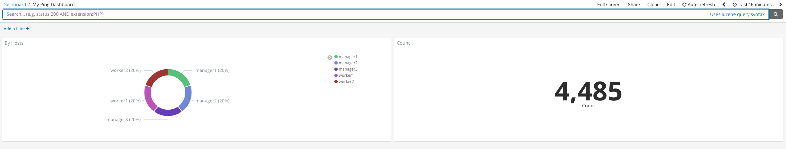

# Docker Swarm & Logging

In the previous exercise we saw how to check out logs for running containers on a single host. In this section we'll be creating services across a Swarm and shipping those logs to a centralized location for easier storage and querying.

> **Tasks**:
>
>
> * [Task 1: Setup the logging stack](#Task_1)
> * [Task 2: Configure services to log centrally](#Task_2)
> * [Task 3: Querying logs in Kibana](#Task_3)
> * [Task 3: Create a Dashboard](#Task_4)
> * [Recap topics covered in this section](#Recap)

## <a name="Task_1"></a>Task 1: Setup the logging stack

For this exercise we're going to use the popular ELK logging stack:

- [ElasticSearch](https://www.elastic.co/) (for storing and indexing large datasets)
- [Logstash](https://www.elastic.co/products/logstash) (for ingesting raw logs and optionally transforming them before sending them to ElasticSearch)
- [Kibana](https://www.elastic.co/products/kibana) (a web UI for querying into ElasticSearch)

1. **Change to the Manager Node** 

2. To get started, let's run the following in our terminal:

    ```
    git clone https://github.com/deviantony/docker-elk.git
    
    Cloning into 'docker-elk'...
    remote: Counting objects: 1238, done.
    remote: Compressing objects: 100% (3/3), done.
    remote: Total 1238 (delta 0), reused 1 (delta 0), pack-reused 1235
    Receiving objects: 100% (1238/1238), 260.98 KiB | 7.68 MiB/s, done.
    Resolving deltas: 100% (468/468), done.
    ```

> **Note:** The ELK stack we're using here is a Dockerized version created by [Anthony Lapenna](https://github.com/deviantony)

2. Move into the `docker-elk` directory and switch to the `docker-stack` branch.

    ```
    cd docker-elk/ 
    ls

    LICENSE           README.md         docker-stack.yml  elasticsearch     extensions        kibana

    ```


### Deploy the ELK stack file to the Swarm

**Docker Desktop Users:** Before continuing, check your Docker for Desktop preferences -> Kubernetes
If "Deploy Docker Stacks to Kubernetes by default" is checked, uncheck. If left checked, the following command will fail.

1. Now we have the stack downloaded, we can deploy it to the Swarm.

    ```
    docker stack deploy -c docker-stack.yml elk

    Creating network elk_elk
    Creating config elk_elastic_config
    Creating config elk_kibana_config
    Creating service elk_logstash
    Creating service elk_kibana
    Creating service elk_elasticsearch
    ```

We can see that Docker created a lot of components on our Swarm.

- `network elk_elk` : a new overlay network so that our services can talk to each other
- `config elk_elastic_config` : configuration for ElasticSearch
- `config elk_kibana_config` : configuration for Kibana
- `service elk_logstash` : service for Logstash
- `service elk_kibana` : service for Kibana
- `service elk_elasticsearch` : service for ElasticSearch


2. Let's `watch` the `docker service ls` command to make sure they all start without any errors:

    ```
     watch docker service ls

    Every 2s: docker service ls                                2018-06-12 16:18:31

    ID                  NAME                MODE                REPLICAS            IMAGE                                                     PORTS
    q3qpjimjsom3        elk_elasticsearch   replicated          0/1                 docker.elastic.co/elasticsearch/elasticsearch-oss:6.2.2   *:9200->9200/tcp,*:9300->9300/tcp
    77hwcyksqdne        elk_kibana          replicated          0/1                 docker.elastic.co/kibana/kibana-oss:6.2.2                 *:5601->5601/tcp
    8sbocpf7462e        elk_logstash        replicated          0/1                 docker.elastic.co/logstash/logstash-oss:6.2.2             *:12201->12201/udp
    ```


3. Once the services have all converged, let's check that we can access the Kibana web UI. 

**PWD**
If you're using PWD then open UCP -> Swarm -> Services -> elk_kibana. Open the endpoint URL in a browser tab. 

**Deployed locally**
If you deployed to a local cluster, you should visit the IP of one of your nodes on port `5601` or just http://localhost:5601

* user: elastic
* password: changeme


You should see the Kibana dashboard appear.



### <a name="Task_2"></a>Task 2: Configure services to log centrally

Now that we have our logging infrastructure setup, let's create a service that will send logs over to it.

1. We have deployed Logstash and exposed port 12201 as an ingress port, which means we can hit any IP in our cluster on that port to send traffic to Logstash, regardless if it's running on that host or not. Let's grab the IP of the host we're on and use that.

    ```
    # Play-with-Docker users
     LOGSTASH=localhost

    # Mac users
     LOGSTASH=0.0.0.0
    ```

2. Now let's start a new test service and pass some logging options so that Docker knows to ship our logs to Logstash.

    ```
     docker service create \
        --name logging-test1 \
        --mode global \
        --log-driver=gelf \
        --log-opt gelf-address=udp://${LOGSTASH}:12201 \
        --log-opt tag="LogTest1 - {{.Name}}/{{.ImageName}}" \
        alpine \
        ping google.com

    mhfj8gujc0ynej6u8ybo3car9
    overall progress: 5 out of 5 tasks
    kw9vz2dve3t9: running   [==================================================>]
    0cjj9gwlbjkh: running   [==================================================>]
    oy0quc1fh770: running   [==================================================>]
    4mrklhm2r3vh: running   [==================================================>]
    vu1dusztugvu: running   [==================================================>]
    verify: Service converged
    ```

Let's run through some of the options here:

- `--name logging-test1` : name of the service
- `--mode global` : one container per Swarm host
- `--log-driver=gelf` : we're going to use the GELF (Graylog Extended Log Format) driver
- `--log-opt gelf-address=udp://${LOGSTASH}:12201` : telling Docker where to send our GELF-formatted logs
- `--log-opt tag="LogTest1 - {{.Name}}/{{.ImageName}}"` : adding a tag to our service for easier querying later
- `alpine` : the image we want to run
- `ping google.com` : the command our service is going to run

> **Notes:**
> - More information about GELF can be found in the Docker [docs here](https://docs.docker.com/config/containers/logging/gelf/)
> - GELF is just one driver available for Docker, for more check out [this page](https://docs.docker.com/config/containers/logging/configure/#supported-logging-drivers)
> - The `tag` logging option is useful as we can use Go's templated strings in there for additional metadata, a full list of the available templates is [here](https://docs.docker.com/config/containers/logging/log_tags/)

3. Check the service is up:

    ```
     docker service ps logging-test1
    ID                  NAME                                      IMAGE               NODE                DESIRED STATE       CURRENT STATE           ERROR          PORTS
    d9z4jarhh0bd        logging-test1.4mrklhm2r3vhoa6be3e47r50j   alpine:latest       manager1            Running             Running 3 minutes ago
    6k6rlloh8rk9        logging-test1.kw9vz2dve3t9hz06rrrvun9uf   alpine:latest       manager2            Running             Running 3 minutes ago
    xc5210kz8d6x        logging-test1.vu1dusztugvumrbu3bt3wnqtx   alpine:latest       worker1             Running             Running 3 minutes ago
    a7p9pz88vgb3        logging-test1.0cjj9gwlbjkhev9m5ypu9hcl6   alpine:latest       manager3            Running             Running 3 minutes ago
    crzpzqp93vcr        logging-test1.oy0quc1fh770f3phjd2dlir5y   alpine:latest       worker2             Running             Running 3 minutes ago

    ```


### <a name="Task_3"></a>Task 3: Querying Logs in Kibana

Now that we have our ELK stack setup, and a service logging to it, let's look in Kibana and review the logs.

1. Before we can query logs in Kibana, we need to setup the _index_. This is pretty straightforward as long as we have some data in our ElasticSearch instance (which by now we should do!).

    1. Open your Kibana tab (or re-open it if you closed it after we verified it was up earlier, it should be on port `5601`).

    2. Click on the 'Setup Index Patterns' button on the top-right'.

    

    3. Enter `logstash-*` as the pattern and hit 'Next Step'.

    

    4. Select `@timestamp` from the drop-down and choose 'Create Index Pattern'.

    

    5. Click 'Discover' on the left-hand menu bar.

2. You should now be looking at the main querying interface of Kibana. Let's add some fields to make the viewing pane a little cleaner.

Hover over the `message` field on the left-hand field list, and hit the `add` button. Repeat for the `container_name` and `tag` fields.



3. We can see that Kibana shows us all the log messages (ping output) from every container in our Swarm, including some additional metadata.

Let's filter on everything from a specific host.

- Click on the `source_host` field in the left-hand field list and remember one of the host IP addresses.

- Above the field list, click the `Add Filter` button and then choose `source_host` as the field, `is` as the operator, and type your chosen IP into the `Value` field.

- The output should change and you will see only logs from that host.

- Now let's run another service so we can query on the tag field.

- Back on one of your manager nodes, run the following:

     ```
    docker service create \
    --name logging-test2 \
    --mode global \
    --log-driver=gelf \
    --log-opt gelf-address=udp://${LOGSTASH}:12201 \
    --log-opt tag="LogTest2 - {{.Name}}/{{.ImageName}}" \
    alpine \
    ping facebook.com

    l7spcatz359qqehuj2sd0rddm
    overall progress: 1 out of 1 tasks
    1/1: running   [==================================================>]
    verify: Service converged
    ```

    - Once the service has converged head back to Kibana.

5. Let's also query on the contents of the `tag` field.

In the search bar at the top of the UI, enter the following query:

```
tag: LogTest2*
```

You should see the list of logs update to show only those from your new service.


6. Feel free to play around with other services and tags, and construct different queries in the Kibana UI. Documentation on the Lucene syntax that ElasticSearch and Kibana use for querying can be [found here](https://www.elastic.co/guide/en/elasticsearch/reference/6.x/query-dsl-query-string-query.html#query-string-syntax).


### <a name="Task_4"></a>Task 4: Create a Dashboard
In this section we will create a simple dashboard based on the ping data we are receiving.

1. Click `Visualize` on the left-hand menu bar.
2. Click "Create new Visualization"
3. Select the Data -> Metric visualization



4. On the left-hand menu select 'Count' as the aggregation type and fill in the custom label to name your visualization.
5. Upper right hand of the ELK screen on the menu bar, select Save.
6. Type in a name of the visualization


**Next, we will create a pie graph**

1. Click `Visualize` on the left-hand menu bar.
2. Click "Create new Visualization" this time it is '+' symbol
3. Select the Basic charts -> Pie visualization



4. On the left-hand menu select `Count` as the aggregation type and fill in the custom label to name your visualization.
5. Expand the Buckets section
6. Select `Count` as the aggregation type
7. Bucket -> Split Splices
8. Aggregation Type -> Term
7. Field -> host.keyword
8. Order by -> metric: Count by host
9. Order -> Decending -> 5
10. Custom Label -> Hosts
11. Upper right hand of the ELK screen on the menu bar, select Save.
12. Type in a name of the visualization



**Finally, put the two new visualizations in a Dashboard**

1. Click 'Dashboard' on the left-hand menu bar.
2. Click 'Add' button either in the middle of the screen or upper right hand corner menu
3. Click the names of the two visualizations that we named earlier.



### Clean Up

Remove the ELK Swarm Stack and running services

  ```
  docker service rm logging-test1 logging-test2
  docker stack rm elk
  ```

### Recap
What did we learn in this section?

* Setting up an ELK stack in our Swarm cluster
* Configuring Docker services to ship logs to our central ELK stack
* Filtering and querying on logs in Kibana
* Create a simple dashboard


## Next Steps
For the next step in the tutorial, head over to the [Docker Monitoring](../monitoring/stats.md) section.
